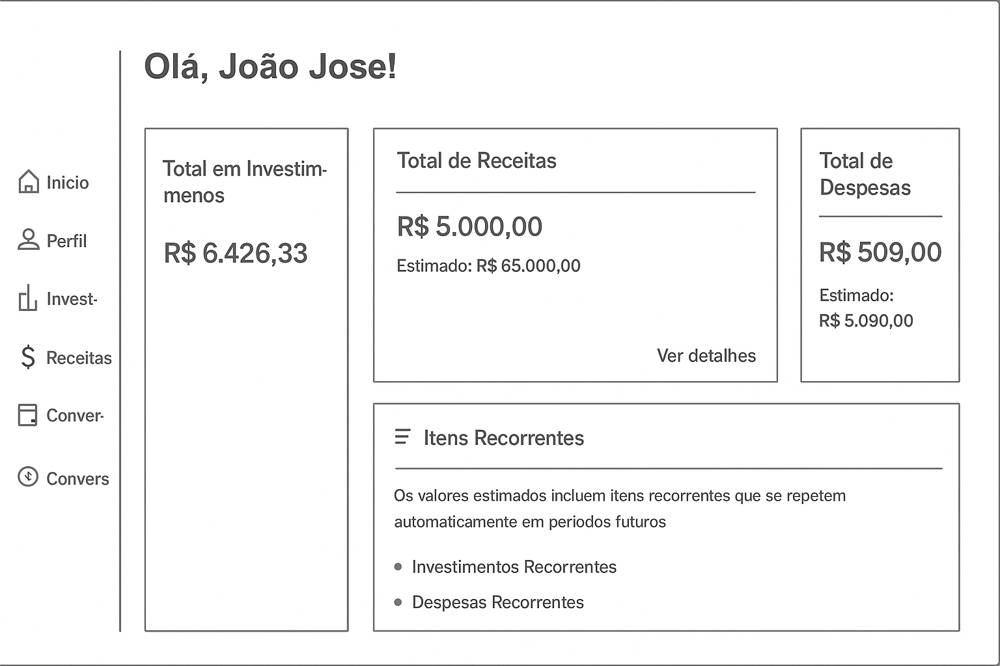

# Projeto de Interface

Pré-requisitos: <a href="2-Especificação do Projeto.md"> Documentação de Especificação</a>

Visão geral da interação do usuário pelas telas do sistema e protótipo interativo das telas com as funcionalidades que fazem parte do sistema (wireframes).

 Apresente as principais interfaces da plataforma. Discuta como ela foi elaborada de forma a atender os requisitos funcionais, não funcionais e histórias de usuário abordados nas <a href="2-Especificação do Projeto.md"> Documentação de Especificação</a>.

## Diagrama de Fluxo

O diagrama apresenta o estudo do fluxo de interação do usuário com o sistema interativo e  muitas vezes sem a necessidade do desenho do design das telas da interface. Isso permite que o design das interações seja bem planejado e gere impacto na qualidade no design do wireframe interativo que será desenvolvido logo em seguida.

O diagrama de fluxo pode ser desenvolvido com "boxes" que possuem internamente a indicação dos principais elementos de interface - tais como menus e acessos - e funcionalidades, tais como editar, pesquisar, filtrar, configurar - e a conexão entre esses boxes a partir do processo de interação. Você pode ver mais explicações e exemplos https://www.lucidchart.com/blog/how-to-make-a-user-flow-diagram.

### Diagrama de Fluxo do Save Money v2

O projeto Save Money v2 possui um diagrama de fluxo detalhado que mapeia a jornada do usuário através da aplicação de gestão financeira. Este diagrama foi desenvolvido para garantir uma experiência de usuário intuitiva e eficiente.

O fluxo de interação foi projetado considerando os seguintes aspectos:
- **Onboarding**: Processo de cadastro e configuração inicial
- **Dashboard Principal**: Visão geral das finanças e navegação principal
- **Gestão de Receitas e Despesas**: Fluxo para adicionar, editar e categorizar transações
- **Relatórios e Análises**: Visualização de dados e insights financeiros
- **Configurações**: Personalização da aplicação e perfil do usuário

### Wireframes do Save Money v2

O projeto Save Money v2 desenvolveu wireframes detalhados para todas as principais funcionalidades da aplicação. Estes wireframes foram criados utilizando ferramentas modernas de design e seguem as melhores práticas de UX/UI.

#### Principais Telas e Funcionalidades

1. **Tela de Login e Cadastro**
   - Formulário de autenticação
   - Processo de registro de novos usuários
   - Recuperação de senha

2. **Dashboard Principal**
   - Visão geral das finanças
   - Gráficos de receitas vs despesas
   - Resumo mensal e anual
   - Navegação para funcionalidades principais

3. **Gestão de Transações**
   - Formulário para adicionar receitas e despesas
   - Lista de transações com filtros
   - Edição e exclusão de transações
   - Categorização automática e manual

4. **Relatórios e Análises**
   - Gráficos interativos
   - Filtros por período e categoria
   - Exportação de dados
   - Comparativos mensais/anuais

5. **Configurações e Perfil**
   - Dados pessoais do usuário
   - Preferências da aplicação
   - Categorias personalizadas
   - Configurações de notificações

### Validação de Usabilidade

Os wireframes foram validados através de:
- Testes com usuários reais
- Análise de heurísticas de Nielsen
- Revisão por especialistas em UX
- Iterações baseadas em feedbacks
